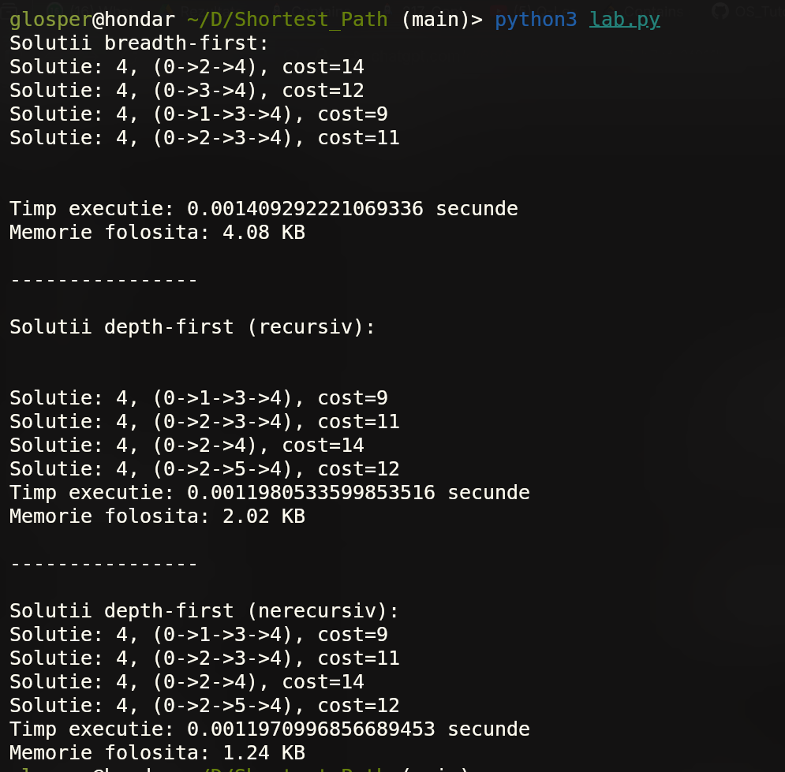
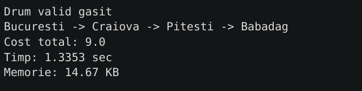

# Minimal Cost Path Comparison

A performance comparison between **Q-Learning** and classical algorithms for finding paths with minimal total cost in a graph.

## Overview

This project demonstrates how a Q-Learning agent can learn to navigate a graph efficiently and compares it with traditional algorithms like BFS. The focus is on evaluating:

BFS and DFS performance  
  

Qlearning performance  
  

